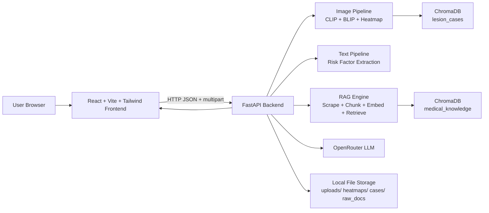
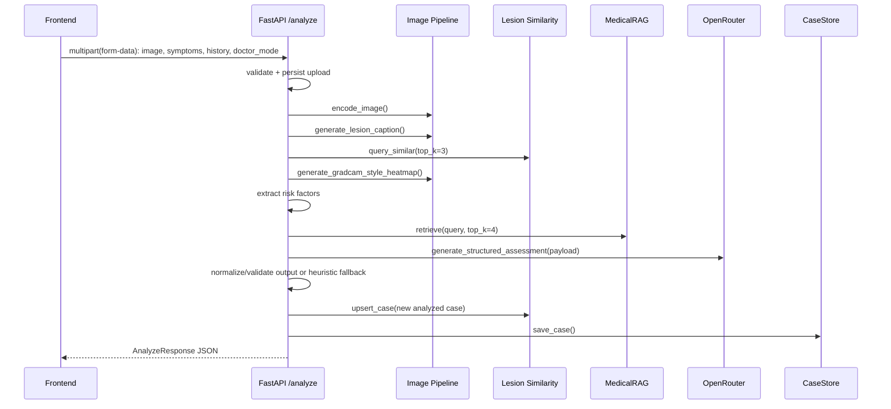
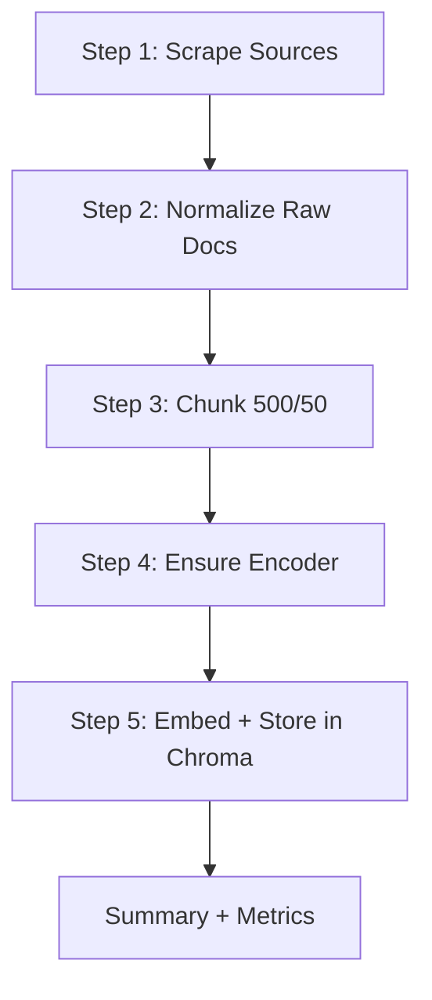

# ORISIGHT Architecture

## 1. Overview

ORISIGHT is a hackathon MVP clinical decision-support web app for oral lesion screening assistance.  
It performs multimodal reasoning over:

1. Oral cavity image upload
2. Symptoms text
3. Medical/history text

It returns:

- Probable diagnosis
- Risk level
- Differential diagnoses
- Suggested investigations
- Treatment plan
- Referral recommendation
- Explainability artifacts (image caption, heatmap, similar cases, retrieved knowledge)

Important constraint: this is **not** a medical diagnostic device. The architecture is optimized for demo reliability, explainability, low cost, and graceful degradation when ML dependencies or external APIs are unavailable.

---

## 2. System Topology



---

## 3. Runtime Components

### 3.1 Frontend (`frontend/react_app`)

- Framework: React 18 + Vite + TailwindCSS + custom CSS design system.
- Main UI component: `src/App.jsx`.
- API client: `src/api.js`.
- Responsibilities:
  - Collect input modalities (image, symptoms, history).
  - Trigger analysis (`POST /analyze`).
  - Trigger knowledge bootstrap (`POST /scrape` then `POST /embed`).
  - Render structured output and explainability artifacts.
  - Enable doctor review override (`POST /report/{case_id}/review`).

Frontend state machine:

1. Idle: no result yet.
2. Input-ready: image + text captured.
3. Analyze loading: submit multipart payload.
4. Analyze complete: render report + explainability.
5. Optional review mode: edited payload submitted and persisted.

### 3.2 Backend API (`backend/main.py`, `backend/api.py`)

- Framework: FastAPI.
- CORS middleware configured from `CORS_ORIGINS`.
- Static files mounted at `/static` from `backend/data` for uploaded images and heatmaps.
- Router endpoints:
  - `GET /health`
  - `POST /analyze`
  - `POST /scrape`
  - `POST /embed`
  - `GET /report/{case_id}`
  - `POST /report/{case_id}/review`

### 3.3 Multimodal Processing Layer

Orchestrated inside `/analyze`:

1. Image persistence
2. Image embedding
3. Image caption generation
4. Similar lesion retrieval
5. Heatmap generation
6. Risk factor extraction from text + caption
7. RAG retrieval for guidance context
8. OpenRouter structured reasoning
9. Heuristic fallback output if LLM unavailable/invalid
10. Response validation and case persistence

### 3.4 RAG and Vector Stores

Two persistent Chroma stores:

1. `backend/vector_db/medical_docs`: collection `medical_knowledge`
2. `backend/vector_db/lesion_images`: collection `lesion_cases`

Both services include memory fallback when Chroma is not available.

---

## 4. End-to-End Analyze Request Flow



Detailed behavior by stage:

1. **Input reception**
   - `image` required multipart file.
   - `symptoms`, `history` required form fields.
   - `doctor_mode` optional boolean.
2. **Upload persistence**
   - File stored under `backend/data/uploads/{case_id}.{ext}`.
   - Empty file returns `400`.
   - I/O failure returns `500`.
3. **Image embedding**
   - Primary: CLIP ViT-B/32 via HuggingFace (`openai/clip-vit-base-patch32`).
   - Fallback: deterministic 512-D RGB histogram embedding.
   - Hard failure in this stage returns `422` (cannot process image).
4. **Image captioning**
   - Primary: BLIP caption model.
   - Fallback: heuristic caption based on redness/brightness.
   - Failure does not abort request.
5. **Similarity search**
   - Query top 3 lesion cases from Chroma collection `lesion_cases`.
   - Similarity computed as `1 - distance` (cosine space).
   - On failure, returns empty list and continues.
6. **Heatmap explainability**
   - Generates Grad-CAM-style proxy using color saliency + edge gradients.
   - Saved to `backend/data/heatmaps/{case_id}_heatmap.png`.
   - On failure, falls back to original image URL.
7. **Risk extraction**
   - Keyword rules over symptoms + history + caption:
     - tobacco chewing
     - areca nut consumption
     - alcohol use
     - burning sensation
     - restricted mouth opening
     - persistent white/red patches
8. **RAG retrieval**
   - Query formed from symptoms/history/caption.
   - Retrieves top 4 chunks from `medical_knowledge`.
   - On empty DB/failure, returns empty knowledge list and continues.
9. **LLM reasoning**
   - Sends multimodal summary to OpenRouter chat completions.
   - Asks for strict JSON schema.
   - If API key missing or call fails/invalid JSON, returns `None`.
10. **Fallback reasoning**
   - Heuristic diagnosis/risk scoring combines:
     - text hint matches
     - similar-case weighted votes
     - risk-factor count
   - Produces structured output compatible with response schema.
11. **Validation + persistence**
   - Output validated against `DiagnosisOutput`.
   - Case persisted in JSON file store.
   - Also upserted into lesion similarity index for future CBR.

---

## 5. RAG Ingestion Architecture

Primary script: `scripts/build_rag_database.py`



### 5.1 Data Sources

Scraped by `backend/scraper.py`:

- Oral Cancer Foundation
- PubMed abstracts via NCBI E-utilities (`esearch`, `efetch`)
- WHO oral health fact sheet
- NCBI book summaries
- Dataset metadata pages (Mendeley, ScienceDirect, Nature)

### 5.2 Document Model

Each raw document saved as JSON in `backend/data/raw_docs`:

- `id` (stable SHA1)
- `source`
- `title`
- `url`
- `text` (cleaned)
- `metadata`

### 5.3 Cleaning and Normalization

- HTML tag removal
- whitespace normalization
- empty-text filtering

### 5.4 Chunking

- chunk size: 500 tokens (implemented as words in current code)
- overlap: 50 tokens (words)
- stable chunk IDs generated from document ID + chunk index + prefix

### 5.5 Embeddings

- Primary model: `all-MiniLM-L6-v2` via `sentence-transformers`.
- If unavailable:
  - optional auto-install from `backend/requirements-ml.txt`
  - fallback hashed embedding (deterministic sparse vector) if allowed.

### 5.6 Storage

- Chroma persistent client path: `backend/vector_db/medical_docs`
- collection name: `medical_knowledge`
- cosine similarity space
- duplicate prevention via pre-check existing chunk IDs
- batched inserts

### 5.7 Retrieval

- Query embedded with same encoder.
- Top-k nearest chunks returned with:
  - source/title/url/chunk/score
- Collection-stale retry logic refreshes collection handle automatically.

---

## 6. Image Pipeline Architecture

### 6.1 CLIP Embedding (`backend/image_pipeline/clip_encoder.py`)

- Model load is memoized (`lru_cache`).
- Configurable offline mode via `ALLOW_MODEL_DOWNLOADS`.
- Output normalized embedding vector.
- Fallback if model missing: histogram embedding to keep pipeline live.

### 6.2 BLIP Captioning (`backend/image_pipeline/image_caption.py`)

- Model + processor lazy-loaded and memoized.
- Generates short lesion caption.
- Fallback caption synthesized from color/luminance statistics.

### 6.3 Explainability Heatmap (`backend/image_pipeline/heatmap.py`)

- Not true Grad-CAM from trained lesion classifier.
- Proxy uses:
  - redness-weighted saliency
  - edge magnitude from image gradients
  - jet colormap overlay
- Purpose: intuitive localization cue for demo explainability.

### 6.4 Similarity and Case-Based Reasoning (`backend/image_pipeline/lesion_similarity.py`)

- Ingest sources:
  - Existing analyzed cases (auto-upsert after each `/analyze`)
  - Optional seed directory (`backend/data/lesion_seed`)
- Metadata enrichment:
  - diagnosis
  - source marker
  - risk level / filename
- Retrieval output:
  - `case_id`
  - `diagnosis`
  - `similarity`
  - `metadata`
- Includes collection-stale retry + memory fallback.

---

## 7. LLM Reasoning Architecture

Component: `backend/openrouter_client.py`

### 7.1 Prompt Inputs

- Symptoms
- History
- Image caption
- Extracted risk factors
- Similar case snippets
- Retrieved RAG chunks

### 7.2 Model Invocation

- Endpoint: `{OPENROUTER_BASE_URL}/chat/completions`
- Default model: `deepseek/deepseek-chat-v3`
- Temperature: `0.2`
- `response_format: {"type": "json_object"}` for structured output

### 7.3 Reliability Controls

- Missing API key: skip LLM and use heuristics.
- HTTP failure/timeout: log and use heuristics.
- Malformed response: JSON extraction fallback regex.
- Final validation via Pydantic schema.

---

## 8. Data Contracts

Primary API response schema (`AnalyzeResponse`):

```json
{
  "case_id": "uuid",
  "output": {
    "diagnosis": "string",
    "differential_diagnosis": ["string"],
    "risk_level": "string",
    "suggested_tests": ["string"],
    "treatment_plan": ["string"],
    "referral": "string",
    "confidence_score": "string"
  },
  "explainability": {
    "image_caption": "string",
    "risk_factors": ["string"],
    "similar_cases": [
      {"case_id": "string", "diagnosis": "string", "similarity": 0.0, "metadata": {}}
    ],
    "retrieved_knowledge": [
      {"source": "string", "chunk": "string", "score": 0.0}
    ],
    "image_url": "string",
    "heatmap_url": "string",
    "disclaimer": "Hackathon MVP only. Not a medical diagnostic device."
  },
  "doctor_mode_enabled": true
}
```

Doctor review mutation (`POST /report/{case_id}/review`):

- Allows clinician override of all output fields.
- Stores review metadata: `reviewed_at`, `notes`, `confirmed`.

---

## 9. Storage Architecture

### 9.1 File System (persistent app data)

- `backend/data/uploads`: original uploaded images
- `backend/data/heatmaps`: generated overlays
- `backend/data/cases`: case records (JSON)
- `backend/data/raw_docs`: scraped source documents
- `backend/data/lesion_seed`: optional seed images + `metadata.json`

### 9.2 Vector Databases

- `backend/vector_db/medical_docs`: RAG chunks
- `backend/vector_db/lesion_images`: lesion similarity embeddings

Both directories are bind-mounted in Docker so indices persist across restarts.

---

## 10. Logging and Observability

Structured stage logging is implemented in analyze pipeline:

- `stage=image_embedding`
- `stage=similarity_search`
- `stage=rag_retrieval`
- `stage=llm_request`

Additional logging:

- RAG builder logs each step and totals (docs, chunks, backend, elapsed).
- Embedding/model initialization warnings include fallback reasons.
- Chroma stale collection handling logs automatic refresh/retry events.

This makes demo troubleshooting straightforward without introducing heavy observability infrastructure.

---

## 11. Error Handling Strategy

Design principle: fail soft where possible, fail hard only on critical invariants.

Hard-stop failures:

- empty upload image (`400`)
- upload save failure (`500`)
- unrecoverable image encoding failure (`422`)
- case save failure (`500`)

Soft-degradation failures:

- caption generation failure -> heuristic caption
- similarity retrieval failure -> empty similar cases
- heatmap failure -> original image fallback
- empty/failed RAG retrieval -> empty context
- OpenRouter/API/JSON failure -> heuristic clinical output

Result: the endpoint remains functional for internal demo even in constrained offline environments.

---

## 12. Deployment Architecture

Compose file: `docker-compose.yml`

Services:

1. `backend`
   - Build: `backend/Dockerfile`
   - Port mapping: `${BACKEND_PORT:-8000}:8000`
   - Volumes:
     - `./backend/data:/app/backend/data`
     - `./backend/vector_db:/app/backend/vector_db`
2. `frontend`
   - Multi-stage build `frontend/react_app/Dockerfile`
   - Build arg: `VITE_API_BASE_URL`
   - Nginx serves static Vite build on `${FRONTEND_PORT:-5173}:80`

Build-context optimization:

- Root `.dockerignore` excludes:
  - `.git`, virtual envs, caches
  - `node_modules`, `dist`
  - runtime artifacts and vector DB files

This prevents multi-GB context transfers during image build.

---

## 13. Request/Response Lifecycle (Operational View)

### 13.1 Analyze Lifecycle

1. Browser sends multipart request.
2. API saves image and starts per-stage logs.
3. Image pipeline returns embedding/caption/heatmap.
4. Similarity service returns top similar cases.
5. Text pipeline extracts rule-based risk factors.
6. RAG engine retrieves knowledge chunks.
7. OpenRouter client returns structured reasoning (or none).
8. Heuristic reconciliation ensures complete JSON.
9. Case persisted and response returned to frontend.
10. Frontend renders report, explainability, and review form.

### 13.2 Knowledge Bootstrap Lifecycle

1. Frontend triggers `/scrape`.
2. Scraper collects and saves raw docs.
3. Frontend triggers `/embed`.
4. RAG indexer chunks+embeds docs and writes to Chroma.
5. Optional lesion seed images are ingested for similarity search.

### 13.3 Doctor Review Lifecycle

1. Frontend pre-fills editable fields from generated output.
2. Doctor edits and submits review.
3. Backend applies field-level overrides.
4. Persisted case now contains updated report + review metadata.

---

## 14. Security, Privacy, and Safety (Demo Scope)

Current state (MVP):

- No authentication/authorization.
- PHI encryption at rest not implemented.
- No audit trail beyond JSON files and logs.
- CORS currently open to configured local origins.

For production hardening:

1. Add auth (OIDC/JWT + role-based access).
2. Encrypt storage and isolate tenant data.
3. Add immutable audit logs.
4. Add consent, retention, and deletion workflows.
5. Add clinical governance and model validation pipelines.

---

## 15. Performance and Cost Controls

Implemented controls:

- Single LLM call per analysis.
- Local vector retrieval to shrink LLM context.
- Deterministic fallbacks prevent expensive retries.
- Cached model objects via `lru_cache`.
- Chunk deduplication via stable IDs.
- Cheap default model on OpenRouter.
- Optional heavy ML dependencies separated into `requirements-ml.txt`.

---

## 16. Known Limitations

1. Heatmap is a heuristic overlay, not clinical-grade attribution.
2. Token chunking is word-based, not true tokenizer-aligned.
3. Heuristic fallback logic is rule-based and simplistic.
4. No user/account/security layers.
5. No formal evaluation metrics (AUC, sensitivity, specificity) in-app.

These are acceptable for internal hackathon demo goals but must be addressed for clinical deployment.

---

## 17. Future Evolution Path

### Near-term

1. Add asynchronous job queue for scrape/embed workflows.
2. Introduce background task + progress endpoints.
3. Add report export (PDF/structured JSON).
4. Add regression test fixtures for `/analyze`.

### Mid-term

1. Replace heuristic heatmap with validated explainability method.
2. Add calibrated confidence model and uncertainty reporting.
3. Add multilingual patient text normalization.
4. Add quality gates for ingestion source trust scoring.

### Long-term

1. Clinical data governance and consent enforcement.
2. Human-in-the-loop adjudication workflow dashboards.
3. External EHR/FHIR integration.
4. Continuous monitoring for model drift and bias.

---

## 18. File-Level Responsibility Map

- `backend/main.py`: App boot, middleware, static mount.
- `backend/api.py`: API contracts and multimodal orchestration.
- `backend/config.py`: settings/env and path bootstrap.
- `backend/models.py`: Pydantic request/response schemas.
- `backend/openrouter_client.py`: LLM transport + prompt builder.
- `backend/rag_pipeline.py`: raw-doc indexing and retrieval.
- `backend/scraper.py`: source scraping and raw document creation.
- `backend/embedding.py`: text chunking and embedding helpers.
- `backend/case_store.py`: persistent case storage and review updates.
- `backend/image_pipeline/*`: embedding, captioning, heatmap, similarity.
- `scripts/build_rag_database.py`: one-command end-to-end RAG build.
- `frontend/react_app/src/App.jsx`: UI workflow and state orchestration.
- `frontend/react_app/src/api.js`: HTTP adapters for backend endpoints.
- `docker-compose.yml`: multi-service local deployment topology.

---

## 19. Summary

ORISIGHT’s architecture is a resilient multimodal pipeline designed for hackathon constraints:

- robust offline/degraded behavior,
- explainability-first outputs,
- retrieval-augmented reasoning with cheap LLM usage,
- case persistence and doctor review loop,
- local Docker deployability without GPU.

It is intentionally engineered to keep the demo functioning even when ML models, vector stores, or external APIs are partially unavailable.
