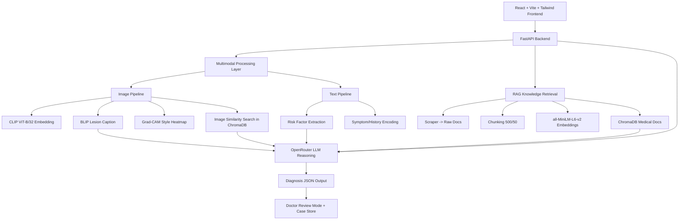

# ORISIGHT

ORISIGHT is a hackathon MVP for AI-assisted oral lesion screening support using multimodal reasoning.

> Not a real medical diagnostic tool. Demo use only.

## 1) System Architecture



## 2) Project Structure

```text
ORISIGHT/
├── backend/
│   ├── main.py
│   ├── api.py
│   ├── rag_pipeline.py
│   ├── scraper.py
│   ├── embedding.py
│   ├── openrouter_client.py
│   ├── generate_embeddings.py
│   ├── scrape_data.py
│   ├── case_store.py
│   ├── image_pipeline/
│   │   ├── clip_encoder.py
│   │   ├── image_caption.py
│   │   ├── lesion_similarity.py
│   │   └── heatmap.py
│   ├── vector_db/
│   │   ├── medical_docs/
│   │   └── lesion_images/
│   └── data/
│       ├── raw_docs/
│       ├── uploads/
│       ├── heatmaps/
│       ├── lesion_seed/
│       └── cases/
├── frontend/
│   └── react_app/
│       ├── src/
│       │   ├── App.jsx
│       │   ├── api.js
│       │   ├── main.jsx
│       │   └── index.css
│       ├── Dockerfile
│       └── nginx.conf
├── docker-compose.yml
└── README.md
```

## 3) Backend Features

- **`POST /analyze`**
  - Accepts oral image + symptoms + history
  - Runs CLIP embedding, BLIP captioning, heatmap generation
  - Retrieves similar lesion cases from ChromaDB
  - Retrieves RAG knowledge chunks
  - Calls OpenRouter model (with heuristic fallback)
  - Stores case report for retrieval/review

- **`POST /scrape`**
  - Scrapes Oral Cancer Foundation, dataset metadata pages, NCBI summaries, WHO oral health, and PubMed abstracts
  - Saves raw docs to `backend/data/raw_docs/`

- **`POST /embed`**
  - Chunks docs (500 tokens, overlap 50)
  - Embeds using `all-MiniLM-L6-v2`
  - Stores vectors in ChromaDB medical collection
  - Ingests seed lesion image folder for similarity search

- **`GET /report/{case_id}`**
  - Returns full analyzed case and explainability payload

- **`POST /report/{case_id}/review`**
  - Doctor review mode: edit diagnosis, notes, and confirm case

## 4) Output JSON Contract

```json
{
  "diagnosis": "",
  "differential_diagnosis": [],
  "risk_level": "",
  "suggested_tests": [],
  "treatment_plan": [],
  "referral": "",
  "confidence_score": ""
}
```

## 5) Frontend Features

- React + Vite + Tailwind dashboard
- Image upload + symptoms/history form
- Multimodal diagnosis output cards
- Explainability panel with:
  - image caption
  - risk factors
  - top-3 similar cases
  - RAG retrieved knowledge chunks
  - heatmap visualization overlay output
- Doctor review editor for final verification
- One-click knowledge refresh (`/scrape` + `/embed`)

## 6) Local Run (No Docker)

### Backend

```bash
python3 -m venv .venv
source .venv/bin/activate
pip install -r backend/requirements.txt
# Optional: full ML stack (large download)
# pip install -r backend/requirements-ml.txt
cp backend/.env.example backend/.env
uvicorn backend.main:app --reload --host 0.0.0.0 --port 8000
```

### Frontend

```bash
cd frontend/react_app
npm install
npm run dev
```

Frontend URL: `http://localhost:5173`

## 7) Docker Run

```bash
cp backend/.env.example backend/.env
# add OPENROUTER_API_KEY in backend/.env

BACKEND_PORT=8001 FRONTEND_PORT=5173 docker compose up --build
```

- Frontend: `http://localhost:5173`
- Backend: `http://localhost:8000`
- API docs: `http://localhost:8000/docs`

## 8) Seeding Optional Similarity Images

Place labeled lesion images in:

```text
backend/data/lesion_seed/
```

Optional mapping file:

```text
backend/data/lesion_seed/metadata.json
```

Format:

```json
{
  "img_001.jpg": "Leukoplakia",
  "img_002.jpg": "Oral Submucous Fibrosis"
}
```

Then call:

```bash
curl -X POST http://localhost:8000/embed -H 'Content-Type: application/json' -d '{"reindex": false}'
```

## 9) Cost/Performance Optimizations

- OpenRouter uses cheap default model: `deepseek/deepseek-chat-v3`
- LLM call is single-pass per analysis
- Retrieval-first prompting limits token usage
- Embeddings are cached by stable chunk IDs in ChromaDB (no duplicate adds)
- CPU-friendly fallback logic for CLIP/BLIP availability issues
- Lightweight default backend image (heavy ML libs moved to optional `backend/requirements-ml.txt`)

## 10) Full Test Request

Set env (optional):

```bash
cp backend/.env.example backend/.env
# Set OPENROUTER_API_KEY to test LLM path
# Keep ALLOW_MODEL_DOWNLOADS=false for fast fallback testing
```

Start API:

```bash
source backend/.venv/bin/activate
uvicorn backend.main:app --host 127.0.0.1 --port 8001
```

### Curl test

```bash
curl -X POST http://127.0.0.1:8001/analyze \
  -F "image=@/tmp/orisight_test.jpg" \
  -F "symptoms=Burning sensation with persistent white patch and restricted mouth opening" \
  -F "history=Areca nut chewing daily, tobacco chewing for 10 years, occasional alcohol" \
  -F "doctor_mode=true"
```

### Python requests test

```python
import requests

url = "http://127.0.0.1:8001/analyze"
files = {"image": open("/tmp/orisight_test.jpg", "rb")}
data = {
    "symptoms": "Burning sensation with persistent white patch and restricted mouth opening",
    "history": "Areca nut chewing daily, tobacco chewing for 10 years, occasional alcohol",
    "doctor_mode": "true",
}

resp = requests.post(url, files=files, data=data, timeout=120)
resp.raise_for_status()
print(resp.json())
```

## 11) Build RAG Database Script

Use the full ingestion runner:

```bash
source backend/.venv/bin/activate
python scripts/build_rag_database.py --reindex
```

Run inside Docker backend container (Python 3.11 + ChromaDB):

```bash
BACKEND_PORT=8001 FRONTEND_PORT=5173 docker compose up -d --build
docker compose exec backend python /app/scripts/build_rag_database.py --reindex
```

If running on Python 3.14 (where Chroma may fail), allow fallback storage:

```bash
python scripts/build_rag_database.py --reindex --allow-memory-fallback
```

Flags:

- `--pubmed-query "oral potentially malignant disorders"`: PubMed search query
- `--pubmed-max-results 8`: number of PubMed abstracts to fetch
- `--model all-MiniLM-L6-v2`: sentence-transformers embedding model
- `--reindex`: rebuild collection from scratch
- `--allow-memory-fallback`: continue even if ChromaDB is unavailable
- `--allow-embedding-fallback`: continue even if sentence-transformers model cannot load

Pipeline performed:

1. Scrape: Oral Cancer Foundation + PubMed + WHO + NCBI
2. Clean/normalize text
3. Chunk documents at 500 tokens with 50 overlap
4. Embed with `all-MiniLM-L6-v2`
5. Store vectors in ChromaDB
